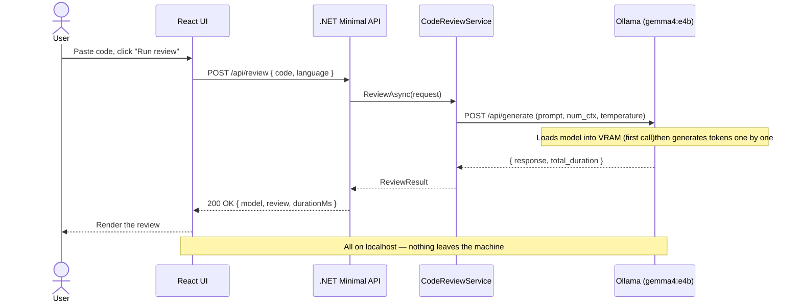
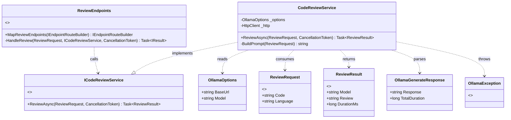

# Code Review Assistant — Live Demo (Gemma 4, local)

[](https://dotnet.microsoft.com/)
[](https://learn.microsoft.com/dotnet/csharp/)
[](https://learn.microsoft.com/aspnet/core/fundamentals/minimal-apis)
[](https://react.dev/)
[](https://www.typescriptlang.org/)
[](https://vitejs.dev/)
[](https://nodejs.org/)
[](https://eslint.org/)
[](https://ollama.com/)
[](https://ai.google.dev/gemma)
[](LICENSE)

A tiny, **fully local** AI-augmented app for the knowledge-sharing session.
You paste code → a local Gemma 4 model reviews it for security, performance and
best practices. No cloud, no API key, no per-request cost. The code never
leaves the machine.

```
React + Vite (TypeScript)  →  .NET Minimal API (C#)  →  Ollama (gemma4:e4b)
        src/App.tsx              /api/review            localhost:11434
```

For the talk, the React app is **built into the .NET app's `wwwroot`**, so the
whole thing still runs as a single local process, see the two workflows below.

---

## 0. Prerequisites (one-time)

| Tool | Why | Get it |
|------|-----|--------|
| **Ollama** | runs Gemma locally, exposes a REST API | https://ollama.com/download |
| **.NET 8 SDK** | builds & runs the backend | https://dotnet.microsoft.com/download |
| **Node.js (LTS)** | builds the React frontend | https://nodejs.org |

---

## 1. Pull the model (one-time, ~4.5 GB)

```bash
ollama pull gemma4:e4b
```

> Tight on VRAM? Use `gemma4:e2b` (~2.9 GB) and set `"Model": "gemma4:e2b"` in
> `appsettings.json`. Smoke test: `ollama run gemma4:e4b "Say hello."`

---

## 2. Architecture

### 2A. Architecture overview


### 2B. Request lifecycle (sequence)



### 2C. Backend class diagram



---

## 3. Project structure

```
CodeReviewAssistant/            # .NET 8 backend
├─ Program.cs                   # thin composition root: configure → map → run
├─ Endpoints
|  └─ ReviewEndpoints.cs           # MapReviewEndpoints() → POST /api/review handler
├─ Exceptions
|  └─ OllamaException.cs
├─ Models
|  ├─ OllamaGenerateResponse.cs
|  ├─ OllamaOptions.cs             # typed config (BaseUrl, Model)
|  ├─ ReviewRequest.cs
|  └─ ReviewResult.cs
├─ Services
|  ├─ ICodeReviewService.cs
|  └─ CodeReviewService.cs      # builds the prompt, calls Ollama, parses the result
├─ appsettings.json             # Ollama base URL + model
└─ wwwroot/                     # the built React app lands here (step 3A)

react-frontend/                 # React + Vite (TypeScript) UI
├─ src/App.tsx                  # the single-screen app: code in → review out
├─ src/main.tsx
├─ src/index.css
└─ vite.config.ts               # builds into ../CodeReviewAssistant/wwwroot; dev proxy for /api

sample-code/
└─ BadExample.cs                # flawed code to paste during the demo
```

The browser only ever calls **your** endpoint, `/api/review`. The backend then
calls **Ollama's** endpoint, `/api/generate`, that hop is server-side and local.

---

## 4. Running it

### 4A. For the talk (reliable — one process)

Build the React app into `wwwroot`, then run only the backend:

```bash
cd react-frontend
npm install            # first time only
npm run build          # outputs into ../CodeReviewAssistant/wwwroot

cd ../CodeReviewAssistant
dotnet run             # serves the UI + the API from one origin
```

Then open the URL `dotnet run` prints (e.g. http://localhost:5xxx). Two local
processes total: `ollama serve` (usually already running) and `dotnet run`.
No CORS, no dev server. This is what to present from.

### 4B. While developing (hot reload)

Run three processes; Vite proxies `/api` to the backend so there's **no CORS**:

```bash
ollama serve                      # terminal 1
cd CodeReviewAssistant && dotnet run   # terminal 2  (note the http port)
cd react-frontend && npm run dev       # terminal 3  (open the Vite URL, :5173)
```

Set the proxy target in `vite.config.ts` (`server.proxy["/api"]`) to the http
port `dotnet run` prints.

> `npm run build` empties `wwwroot` (`emptyOutDir: true`). Keep a copy of the
> original `index.html` if you want to switch back to the no-build version.

---

## 5. Configuration

`appsettings.json`:
```json
"Ollama": { "BaseUrl": "http://localhost:11434", "Model": "gemma4:e4b" }
```

- **Output language** is set in `BuildPrompt()` inside `CodeReviewService.cs`.
- `num_ctx` is raised to 8192 there too, the default 4K context is too small
  for real code. Very large inputs need more.
- Low `temperature` (0.2) keeps reviews consistent rather than creative.

---

## 6. Troubleshooting

| Symptom | Fix |
|---------|-----|
| "Could not reach Ollama" | Start `ollama serve`; confirm http://localhost:11434 responds. |
| "Ollama responded with 404" | Model not pulled: `ollama pull gemma4:e4b`. |
| First response very slow | Normal — model loading into VRAM. Pre-warm before the talk. |
| Out-of-memory / very slow | Switch to `gemma4:e2b` in `appsettings.json`. |
| UI loads but review fails in dev | Check the Vite proxy port matches the `dotnet run` http port. |
| Blank page after build | Confirm `npm run build` wrote into `CodeReviewAssistant/wwwroot`. |
